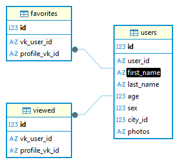

# Командный проект по курсу «Профессиональная работа с Python»

# VKinder

## Описание проекта

VKinder — программа-бота для взаимодействия с базами данных социальной сети. Бот будет предлагать различные варианты людей для знакомств в социальной сети ВКонтакте в виде диалога с пользователем

## Функциональность

Бот выполняет следующие действия:

1. **Поиск пользователей для знакомств**:
   - Используя информацию (возраст, пол, город) о пользователе, который общается с ботом в ВКонтакте, делает поиск других пользователей ВКонтакте для знакомств.

2. **Получение популярных фотографий**:
   - У тех людей, которые подошли под критерии поиска, получает три самые популярные фотографии в профиле. Популярность определяется по количеству лайков.

3. **Вывод информации в чат**:
   - В чат с ботом выводится информация о найденном пользователе в следующем формате:
     - Имя и фамилия
     - Ссылка на профиль
     - Три фотографии в виде вложений (attachment)

4. **Навигация по пользователям**:
   - Пользователи могут перейти к следующему пользователю.

5. **Сохранение в избранное**:
   - Возможность сохранять понравившихся пользователей в списке избранных.

6. **Просмотр избранных пользователей**:
   - Команда для отображения списка всех сохраненных пользователей.

## Порядок работы с проектом

1. **Настройка данных подключения:**

- Убедитесь, что создана группа VK. Получите API ключ группы
- Убедитесь, что создано приложение VK. Получите токен пользователя
- Убедитесь, что заполнены токены в файле `.env` в корне проекта:
  - VK_USER_TOKEN,
  - VK_GROUP_TOKEN

2. **Установка зависимостей:**

- Установите зависимости из файла `requirements.txt`. Для этого выполните команду в терминале:
`bash`
   `pip install -r requirements.txt`

3. **База данных:**

- убедитесь, что создана база данных:
  - наименование - vkinder
  - имя пользователя - postgres
  - пароль - postgres
  Все таблицы будут созданы программой автоматически

    
  
4. **Запуск бота:**

- Запустите файл `main.py`, который содержит основную логику бота. В терминале выполните команду запуска:
   `python main.py`
- Бот должен запуститься и начать слушать входящие сообщения.

5. **Тестирование:**

- Откройте группу VK и отправьте любое сообщение боту.
- Убедитесь, что бот отвечает на ваши сообщения и работает должным образом.
  
### Примечания

- Рекомендуется использовать виртуальное окружение для установки зависимостей, чтобы избежать конфликтов между пакетами в разных проектах.
- Если что-то работает некорректно, проверьте настройки токенов
